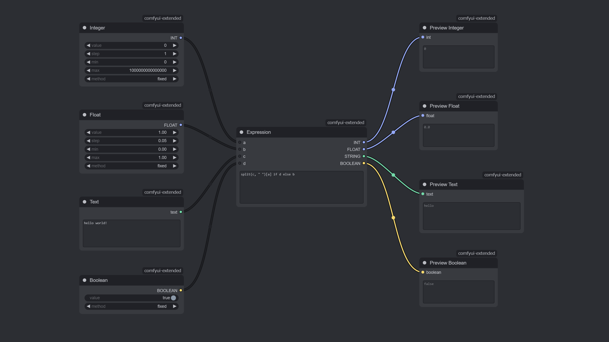

# ComfyUI Extended

Nodes for ComfyUI that extend the core functionality without adding extra dependencies.



## Features

- [x] Preview Nodes
- [x] Primitive Nodes
- [x] Utility Nodes

## Installation

There are 2 ways to install this custom node:

### ComfyUI Manager (Recommended)

1. Install [ComfyUI Manager](https://github.com/ltdrdata/ComfyUI-Manager) if you don't have it yet.
2. Find "ComfyUI Extended" in the Manager and install it.

### Manual

```bash
cd /path/to/your/ComfyUI/custom_nodes
git clone https://github.com/rookiepsi/comfyui-extended.git
```

Restart ComfyUI to load the new nodes.

## Usage

For detailed explanation of each node, please refer to the [docs](docs/README.md).

## Contributing

Contributions are welcome! Please feel free to submit a Pull Request.

## Development

1. Look for an issue to work on or create a new one.
2. Wait for approval.
3. Fork this repository.
4. Create a new branch `feature/[feature-name]` or `bug/[bug-name]`.
5. Make your changes.
6. Test your changes thoroughly.
7. Create a Pull Request.
8. Become a legend.

## License

This project is licensed under the [MIT](LICENSE) license.

## Legends (Contributors)

- [@rookiepsi](https://github.com/rookiepsi)
- [@robinjhuang](https://github.com/robinjhuang)
- [@silveroxides](https://github.com/silveroxides)
